**Plugins de Volatility** 

Volodimir Yarmash Yarmash 

**imageinfo** 

Nos da información sobre la imagen, podemos usarlo para localizar el profile. 

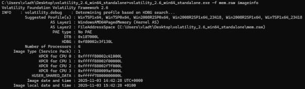

**pslist** 

Podemos listar todos los procesos activos de la imagen. 

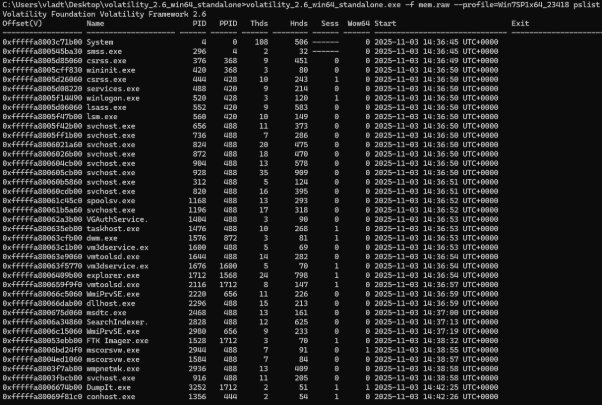

**pstree** 

Podemos listar los procesos activos pero ordenado de padre a hijo, averiguando qué proceso ha ejecutado otro. 

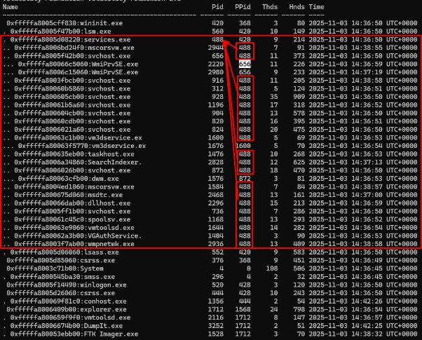

**psscan**  

Escanea la memoria del sistema de forma más profunda que el comando básico pslist. 

Su principal objetivo es encontrar procesos que han sido eliminados de las listas activas del kernel 

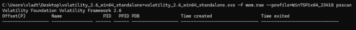

**psxview** 

Compara la lista de procesos activos con la lista de procesos escaneados, entre otros métodos.  

thrdproc(Thread Process List) Verifica si el proceso está referenciado por alguno de sus ETHREAD activos. Un proceso sin hilos activos (o si el proceso ha sido desvinculado de sus hilos) podría ser sospechoso. 

pspcid(Process/PID Table) Verifica la tabla de mapeo usada por Windows para buscar procesos por su ID. Esta es una tabla clave para la funcionalidad del SO. Si es False, el malware ha quitado la entrada del proceso de la tabla PID del kernel, haciéndolo invisible para el sistema operativo estándar. Es un fuerte indicador. 

csrss(Client/Server Runtime Subsystem) Verifica si el proceso está en las estructuras internas que manejan las sesiones y la interacción con el usuario. Si es False, el proceso no está registrado correctamente en el subsistema de tiempo de ejecución de la sesión. session(Session List) Verifica si el proceso está correctamente vinculado a la lista de procesos de la sesión a la que pertenece (por ejemplo, Sesión 1 para el usuario activo). Si es False, el proceso no está en la lista de la sesión. 

deskthrd(Desktop Thread List) Verifica si hay hilos asociados al proceso que están vinculados a un escritorio (W32THREAD). Relevante para procesos que interactúan con la GUI.Si es True, generalmente significa que el proceso ha terminado y solo quedan sus restos en la memoria (es un proceso "zombie"). Si es False, el proceso está en teoría en ejecución. 

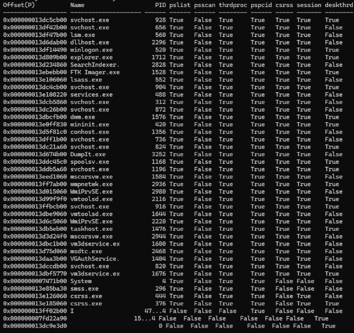

**netscan** 

Escanea la memoria en bruto, identificando todos los sockets abiertos y las conexiones Offset: La ubicación en la memoria donde se encontró la estructura de la conexión. Proto: El protocolo de red (TCP o UDP). 

Local Address y Local Port: La dirección IP y el puerto de origen (del sistema analizado). Foreign Address y Foreign Port: La dirección IP y el puerto de destino o remoto. 

State: El estado de la conexión (ej. ESTABLISHED, LISTEN, CLOSE\_WAIT, CLOSED). PID y Process: El ID de Proceso (PID) y el nombre del proceso responsable de abrir o manejar esa conexión. 

CreateTime y ExitTime: El momento en que se creó y, si aplica, se cerró la conexión. 

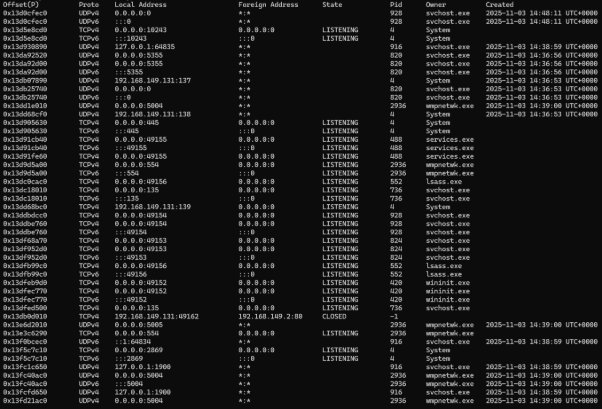

**dlllist** 

Se utiliza para enumerar todas las Dynamic-Link Libraries que han sido cargadas en la memoria de un proceso específico. Los DLL son funciones muy comunes en todos los programas que el propio windows ejecuta para evitar que cada programa tenga que hacerlo por ellos mismos(ej: botón guardar archivo como...). Los hackers pueden hacer un DLL hijacking, introducir un dll malicioso en vez de el dll original.  

Windows busca la DLL en la siguiente secuencia: 

*1.El directorio desde donde se está ejecutando el programa (.exe). 2.El directorio del sistema (C:\Windows\System32).* 

*3.Otros directorios de Windows.* 

*4.Los directorios listados en la variable de entorno PATH.* 

El atacante sabe que un programa legítimo busca la dll, el atacante coloca una versión maliciosa en un directorio que tiene prioridad en la ruta de búsqueda y ejecuta el dll infectado con código ejecutable. 

Pero la anomalía que tenemos es de que se ha modificado el load count a una cantidad disparatada ya que de normal no suele tener tantas cargas. 

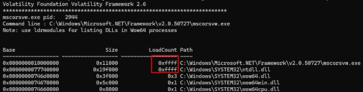

**malfind** 

Plugin diseñado para detectar código malicioso inyectado buscando anomalías comunes. En este caso PAGE\_EXECUTE\_READWRITE es muy sospechoso ya que el codigo en esta region se puede leer, modificar y ejecutar. 

Las regiones que contienen código ejecutable solo necesitan ser READEXECUTE. Permitir las tres propiedades a la vez es una anomalía que los malwares aprovechan para inyectar su código y luego ejecutarlo. 

También extrae y desensambla el contenido binario de esta región sospechosa. 

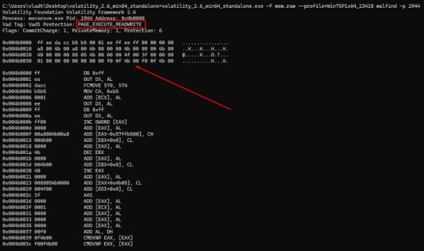

**procdump** 

Este plugin extrae el archivo ejecutable principal asociado a un proceso. 

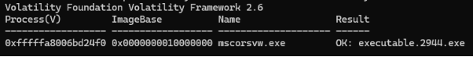

**vaddump**  

Extrae las regiones de memoria virtual (VADs) de un proceso. 

En Windows, cada proceso tiene su propio espacio de direcciones virtuales, que es básicamente un mapa de memoria con los siguientes tipos de regiones: 

Ejecutable principal (.exe) 

Módulos y DLLs cargadas 

Memoria asignada dinámicamente (heap, stack, código inyectado, etc.) 

Regiones de datos o buffers 

Permite extraer cada una de esas regiones en bruto, para analizarlas una por una buscando código malicioso inyectado o cadenas sospechosas. 

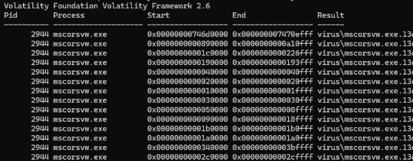

**apihooks** 

Detecta modificaciones (hooks) en funciones de librerías del sistema. Algo que los rootkits y malware en memoria suelen hacer para alterar el 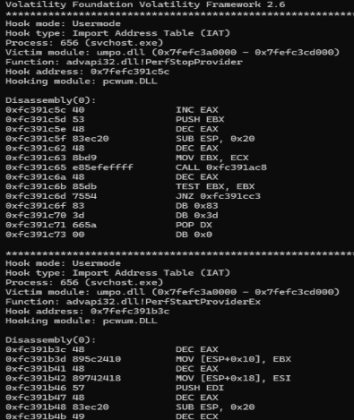

comportamiento de Windows.  En Windows, un “hook” puede usarse legítimamente para monitoreo o antivirus, pero también se usa para: Interceptar llamadas de API, esconder procesos, archivos o conexiones, modificar datos que ve el sistema. 

El plugin te muestra: Qué función fue modificada, qué módulo la alteró, dónde está el código de salto o reemplazo. 

**driverscan** 

Nos hace una lista con todos los drivers cargados y sus detalles 

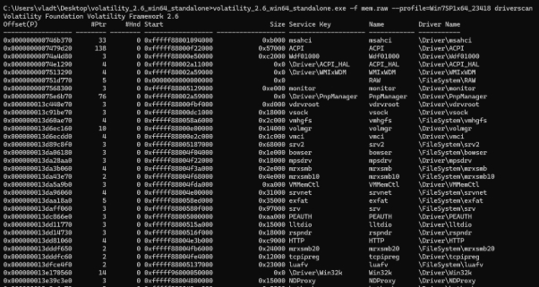

**svcscan** 

Crea una lista con todos los servicios y sus rutas, muchos de los cuales se inician automáticamente con Windows. Pero podemos filtrar a nuestro antojo y buscar servicios que nos interesan. 

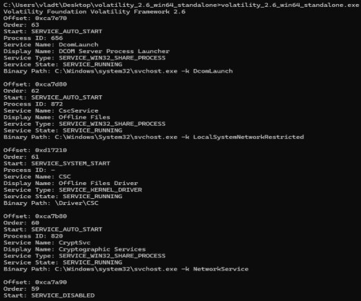

**filescan** 

Con este plugin podemos ver si el malware tiene tareas programadas para ejecutarse al inicio de nuestro sistema. 

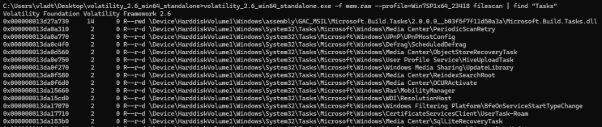

**consoles** 

Recupera el historial de entrada/salida de la consola.  

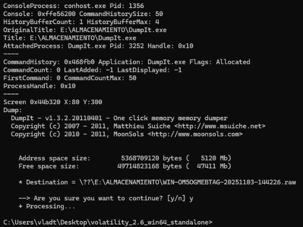

**clipboard** 

Extrae el contenido del portapapeles. 

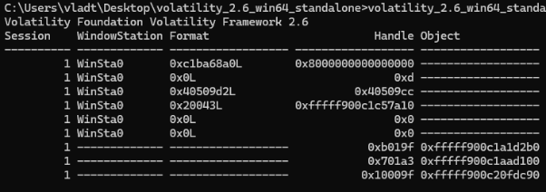

**privs** 

Muestra los privilegios asignado a cada proceso. Podemos localizar los privilegios de los archivos de nuestro malware

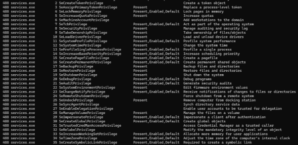

**hashdump** 

Este plugin tiene como objetivo extraer los hashes de las contraseñas de las cuentas de usuario de un sistema Windows. 

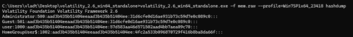

**iehistory** 

Muestra el historial del navegador Internet Explorer. En nuestro caso, no han habido búsquedas. 

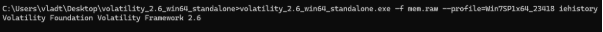
