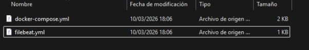
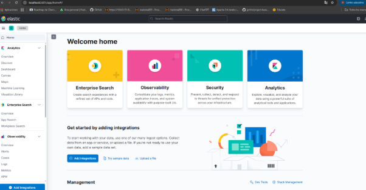
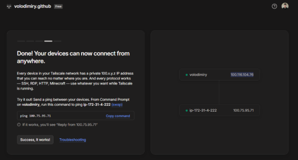
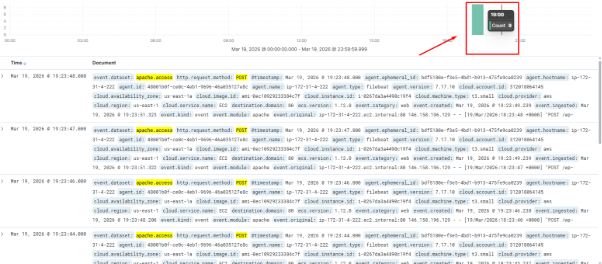
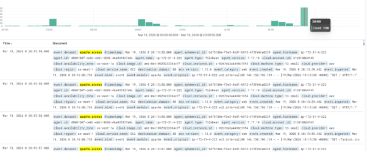



**Implantación de un SIEM con ELK y**

**demostración de un incidente**

Volodimir Yarmash Yarmash

ÍNDICE

[**Objetivo	2**](#_w46o5ijwykc1)

[**Requisitos	3**](#_qc7m2b7wmm2u)

[**1. SIEM:	3**](#_ahz80zptq2c3)

[**2. Víctima	3**](#_6jv4u89h4ja3)

[**3. Ataques / Incidentes	3**](#_38240g18uvmj)

[**4. Evidencias en ELK	3**](#_824xfwgn8vzk)

[**5. Realizacion	4**](#_cztyr89mymo2)

[Levantamiento del SIEM en local con Docker.	4](#_1stctfjx8m4j)

[Objetivo del proyecto.	5](#_k5fus4hgn4d0)

[Comprobación	6](#_dvfwf9ldpyrl)

[**Evaluación (APTO / NO APTO)	7**](#_k2w77qp22hnj)

[**APTO	7**](#_itybx8luyswr)

[**NO APTO	7**](#_uxwjsjg39eni)

[**Entrega de la práctica	7**](#_t2ddyjwmync5)

# Objetivo
El alumno debe ser capaz de montar desde cero un SIEM basado en ELK usando Docker,

crear una máquina víctima, provocar un incidente de seguridad sobre ella y demostrar

en Kibana que dicho incidente queda reflejado correctamente.

La práctica no tiene una solución única. Cada alumno decide cómo lo monta y qué tipo

de incidente genera.

No se evalúa que el sistema sea perfecto ni completo, sino que sea funcional.

Se evalúa que el alumno comprenda y sea capaz de explicar el funcionamiento del SIEM

implantado, el flujo de los logs y la naturaleza del incidente o vulnerabilidad

demostrada.
# Requisitos
# 1. SIEM:
Debe desplegarse un SIEM en Docker que incluya:

• Elasticsearch

• Kibana

• Un mecanismo de ingesta de logs (Logstash y/o Beats)

El SIEM debe estar operativo y accesible.
# 2. Víctima
El alumno debe crear una o varias máquina o servicio víctima que:

• Genere logs de forma observable

• Permita identificar eventos relevantes

La víctima puede ser:

• un servicio de login

• un servicio web

• tráfico de red

• firewall

• ICMP, conexiones, accesos, etc.

La elección es libre.
# 3. Ataques / Incidentes
Debe ejecutarse al menos un ataque o incidente intencionado sobre la víctima, por

ejemplo:

• múltiples intentos de login

• ráfaga de accesos

• escaneo de puertos

• flood de ICMP

• cualquier acción repetitiva que genere eventos

El ataque debe ser:

• realizado sobre el propio entorno

• reproducible

• claramente identificable en el tiempo
# 4. Evidencias en ELK
El alumno debe demostrar en Kibana:

• que los logs llegan al SIEM

• que el incidente genera un patrón claro

• que se pueden identificar al menos:

`   `o el origen del evento

`   `o el tipo de evento

`   `o el momento en el que ocurre

No es obligatorio crear dashboards ni alertas.

# 5. Realizacion
## Levantamiento del SIEM en local con Docker.

Una vez tenemos nuestro docker desktop instalado y bien configurado, tenemos que empezar por el archivo de configuración docker-compose y de filebeat.

Creamos una carpeta para nuestro proyecto y creamos los archivos .yml

El archivo docker-compose.yml es el orquestador. Su función es definir y conectar los cuatro pilares de tu laboratorio en una red aislada de Docker. Esta es la estructura que lleva:

elasticsearch: Actúa como la base de datos NoSQL orientada a documentos donde se indexan y almacenan los logs para que las búsquedas sean instantáneas.

kibana: Es la interfaz gráfica. Se conecta a Elasticsearch para visualizar los datos, realizar búsquedas y generar los gráficos del incidente.

victima-web: Es un servidor web real. Está configurado con un volumen compartido (logs-web) para que sus archivos de log sean accesibles desde fuera del contenedor.

filebeat: Es el agente de transporte. Tiene acceso al mismo volumen de logs que la víctima. Su trabajo es "leer" los logs en tiempo real y "empujarlos" hacia Elasticsearch.

Una vez lo tengamos todo, arrancamos docker con el comando docker-compose up -d al abrir el terminal en la carpeta del proyecto.

Cuando lo tengamos ya todo ejecutado de forma correcta. en el puerto 5601 ya tenemos nuestra aplicación disponible:

## Objetivo del proyecto.
Lo que vamos a hacer una configuración para que con los logs de mi página web Wordpress que tenemos montada en la bube, los pueda analizar nuestro SIEM en local, de esta manera podemos filtrar por ataques de fuerza bruta, ddos, etc.

Configuración Tailscale

TailScale es una herramienta que nos permite juntar redes diferentes y hacer posible la comunicación entre ellas creando un enlace de red.

Lo que vamos a hacer es instalar Tailscale tanto en local como en el EC2 de la nube y lo juntamos mediante un comando simple.

Una vez tenemos el SIEm y la web en la misma red, vamos a redirigir el tráfico.

En la configuración de filebeat que se encuentra en la ruta /etc/filebeat/filebeat.yml

agregamos esto:

output.elasticsearch:

`  `hosts: ["100.X.X.X:9200"] 

` `Reemplazando con la IP de Tailscale de mi PC local, y tambien esto 

` `setup.kibana:

`  `host: "100.X.X.X:5601"

Activar el módulo del sistema (Para detectar fuerza bruta por SSH):

sudo filebeat modules enable system

Activar el módulo web (Para detectar fuerza bruta a WordPress y DDoS).

sudo filebeat modules enable apache

Reiniciamos filebeat y lo tendrémos operativo.

sudo systemctl restart filebeat

## Comprobación
Para comprobar nuestro proyecto, tenemos que ir al panel de kibana y elegimos Discover:

Vamos a realizar varios intentos de login en nuestro Wordpress y a continuación aplicamos este filtro:

event.dataset: "apache.access" AND url.path: "/wp-login.php" AND http.request.method: "POST"

Como podemos ver, acabamos de realizar 9 intentos de acceso con fuerza bruta a nuestro panel de wp-login

Ahora probamos con un script de generar peticiones, filtramos por apache.access

# Evaluación (APTO / NO APTO)
La evaluación será presencial y práctica.

El alumno deberá:

1\. Arrancar el entorno en Docker

2\. Explicar brevemente la arquitectura:

`   `o qué contenedores hay

`   `o cómo llegan los logs a ELK

`   `o cualquier otra información relevante

3\. Ejecutar el ataque/incidente

4\. Mostrar el resultado en Kibana

5\. Explicar qué está ocurriendo
# APTO
• El SIEM funciona

• El incidente se ve claramente en Kibana

• El alumno entiende y explica lo que ha montado
# NO APTO
• No llegan logs

• No se identifica el incidente

• No sabe explicar su propio montaje

• Ha copiado sin comprender
# Entrega de la práctica
Para que la práctica pueda ser calificada, será obligatoria la entrega de dos ficheros. La

ausencia de cualquiera de ellos implicará que la práctica no pueda evaluarse.

El alumno deberá entregar:

1\. Fichero docker-compose.yml

`   `o Debe permitir reproducir el entorno completo del SIEM, la víctima y el

ataque/incidente.

2\. Documento en formato PDF, que incluirá:

`   `o Explicación de la arquitectura montada.

`   `o Capturas de pantalla que evidencien:

▪ el entorno levantado en Docker,

▪ la ejecución del ataque/incidente,

▪ la visualización de los eventos en Kibana.

o Explicaciones necesarias que permitan verificar el funcionamiento del

SIEM y la identificación del incidente.

La documentación deberá ser clara y suficiente para permitir la verificación del

funcionamiento, sin perjuicio de la evaluación presencial y práctica, que será

determinante.

