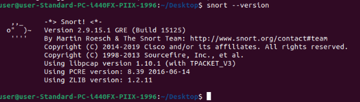
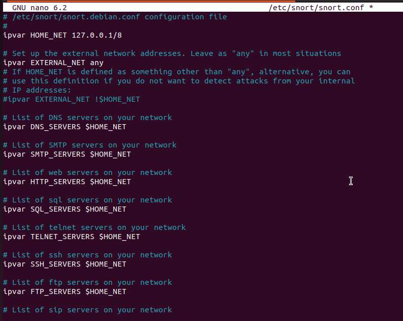
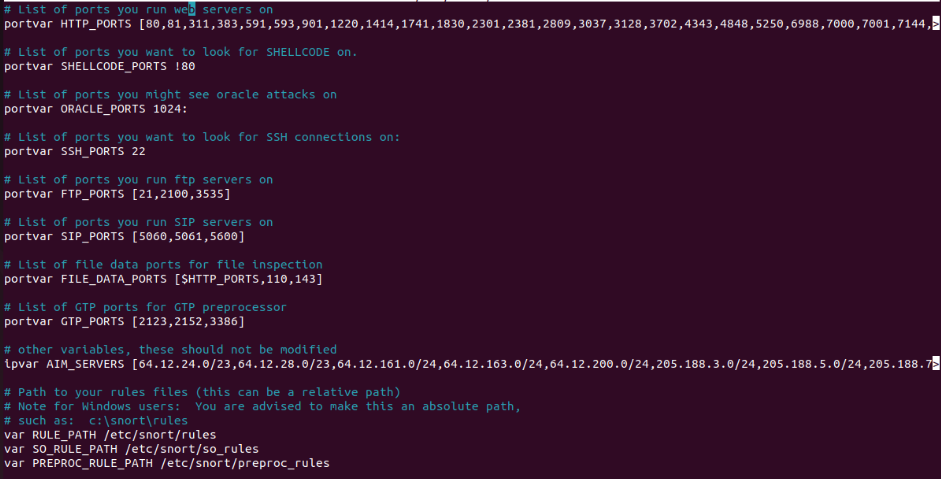
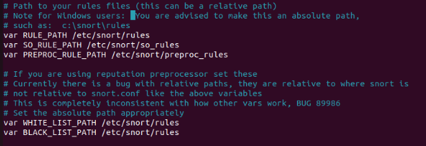
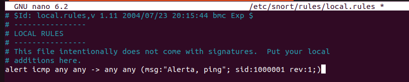
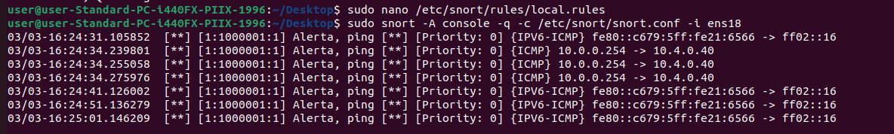
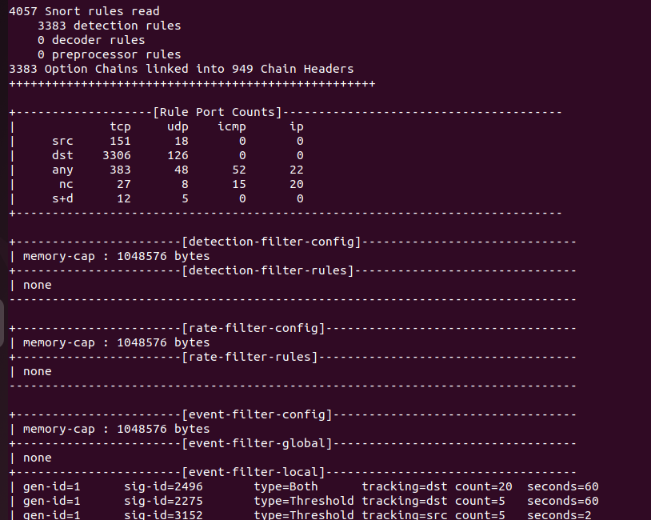
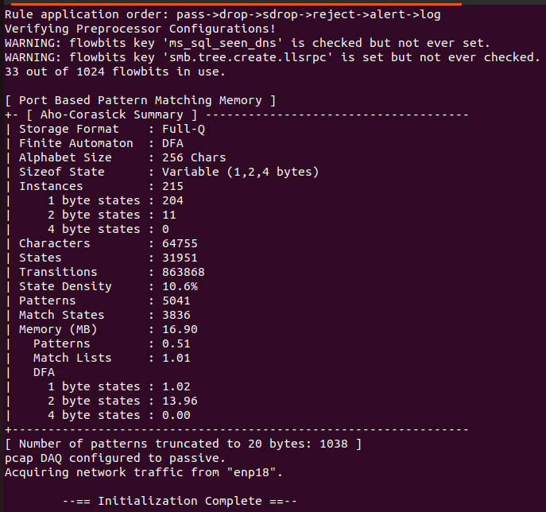

> **Snort** Volodimir Yarmash Yarmash

**Introducción...........................................................................................................................**
**1**
**Procedimiento........................................................................................................................1**
**Resultados..............................................................................................................................4**
**Conclusiones..........................................................................................................................6**

Introducción

El sistema de detección de intrusos y el sistema de prevención de
intrusos ayudan a impedir que los ciberdelincuentes se infiltren en tu
servidor. Estas herramientas de seguridad de red interrumpen
automáticamente el tráfico y activan alertas al detectar una actividad
maliciosa.

En un servidor privado virtual Ubuntu, Suricata es una popular solución
para la detección y prevención de intrusos. Además de ser de código
abierto, esta monitorización del tráfico de red está disponible para
varios sistemas operativos, incluidos Windows y Linux.

Procedimiento

Para iniciar la instalación de Sort,necesitamos una máquina virtual
Ubuntu, hacemos un update y picamos el comando sudo apt-get install
snort.

Como podemos ver, se nos ha
completado la instalación:

Para que snort pueda interceptar todo el tráfico para analizarlo,
tenemos que indicarle la interfaz de red que nos interesa que analize,
para eso vamos a usar este comando: sudo ip link set enp18 promisc on

Ahora vamos a entrar en el archivo de configuración de snort que se
encuentra en /etc/snort/snort.conf. Dentro nos podemos encontrar muchas
variables diferentes:

Aquí podemos agregar muchos servidores diferentes y meterlos en listas,
de momento solo he modificado la ip del dispositivo (HOME_NET) que por
defecto no se incluye.

También tenemos la opcion de agregar puertos custom de muchísimos tipos.

A continuecion tenemos estos dos apartados, uno se encarga de enrutar
los archivos de reglas y otro se refiere al preprocesador de reputación,
permite bloquear o permitir tráfico basándose en direcciones IP.

Estas tres líneas definen la ubicación de los archivos que contienen las
firmas de ataques: **RULE_PATH:** Es la carpeta principal donde se
guardan las reglas estándar (archivos .rules).

**SO_RULE_PATH:** Shared Object rules. Son reglas precompiladas en
lenguaje C, útiles para detectar ataques complejos que las reglas de
texto normal no pueden manejar fácilmente.

**PREPROC_RULE_PATH:** Contiene reglas específicas para los
preprocesadores, que son componentes de Snort que preparan los datos
(como limpiar el tráfico HTTP) antes de que el motor de detección los
revise.

**WHITE_LIST_PATH:** La ruta hacia el archivo con las IPs en las que
confías.

**BLACK_LIST_PATH:** La ruta
hacia el archivo con las IPs maliciosas conocidas

Ahora que ya lo tenemos todos configurado, vamos a la prueba de Snort.
Para eso salimos del archivo guardando los cambios realizados y lanzamos
este comando: snort -T -i (int de red) -c /etc/snort/snort.conf

Al pulsar enter ocurre el escaneo y nos suelta el resultado, en el
apartado de resultados, he subido el resultado del escaneo.

Ahora vamos a crear nuestra propia regla custom para que se registre en
el archivo snort_on.txt.

Para ello, entramos en la ruta /etc/snort/rules/local.rules y agregamos
una regla que detecta los pings a nuestra máquina:

Hacemos la prueba usado el comando sudo snort -A console -q -c
/etc/snort/snort.conf -i ens18

Resultados

Como podemos ver, el escaneo normal con las reglas predeterminada nos
arroja este resultado:

Tambien al crear nuestra regla de deteccion de pings nos suelta esta
respuesta sí simulamos un ataque:

Conclusiones

La implementación de Snort demuestra que la seguridad proactiva es
fundamental para la visibilidad del tráfico de red, permitiendo
diferenciar entre actividades legítimas y potenciales amenazas mediante
reglas personalizadas. Al generar los registros de actividad e
inactividad, se valida que un IDS bien configurado actúa como una
primera línea de defensa crítica, capaz de identificar anomalías en
tiempo real. Finalmente, la flexibilidad de su arquitectura basada en
firmas permite que el sistema se adapte con precisión a ataques

emergentes, consolidándose como una herramienta técnica esencial para
cualquier estrategia de ciberseguridad moderna.
