

**Workflow N8N para Detección de Incidentes**

Volodimir Yarmash Yarmash

**ÍNDICE**

[**Planteamiento del Workflow	3**](#_1hadkpqxz3xc)

[**Herramientas para realizar el proyecto	3**](#_7lse20xlq1on)

[**Instalación	3**](#_4pbmx0hbslmg)

[**Construcción del Workflow en n8n	5**](#_vg3li2h21n79)

[**Configuración Telegram	7**](#_5flmpsc2g4ld)

[**Configuración de Wordpress + code snippets y ngrok	9**](#_l1huc8cxxh6n)

[**Comprobación	11**](#_rm3t0ax3t1hk)

# Planteamiento del Workflow
Mi workflow en n8n se basa en localizar a la persona que ha logrado acceso a mi usuario admin en Wordpress y que un bot me mande un mensaje a telegram con información detallada sobre la ip del usuario si ocurre el acceso al panel, si no es un login desde la localidad habitual, me manda un mensaje de alerta.
# Herramientas para realizar el proyecto
` `Para lograr completar la tarea he tenido que usar:

- N8N

  En local, para montar el workflow.

- [ip-api.com](http://ip-api.com)

  Para extraer datos del posible atacante como la ubicación, hora, etc.

- Telegram bot

  Con su api key, vamos a configurar un envio de mensaje a mi telegram privado.

- AWS (EC2)

  He levantado una tienda-plantilla para simular un posible ataque a mi directorio /wp-login

- Wordpress + code snippets 

  Casi todas las páginas de internet están montadas con WP, por eso la elección. Gracias al plugin Code Snippets, podemos agregar trozos de código.

- ngrok 

  Lo necesitamos para que pueda lograr nuestra red local, su unica fincion es redirigir el tráfico a nuestro n8n local.

# Instalación

Para empezar la practica, necesitamos tener Docker preinstalado en nuestro dispositivo.

Preparamos una carpeta e introducimos el archivo de configuración .yml. Por la terminal, accedemos a nuestra carpeta y teniendo el motor de Docker activo,  ejecutamos el comando docker compose -f (arch.ylm) up -d.

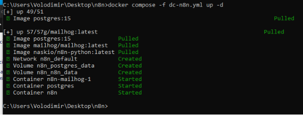

Esperamos a que se monte y accedemos al puerto 5678 local.

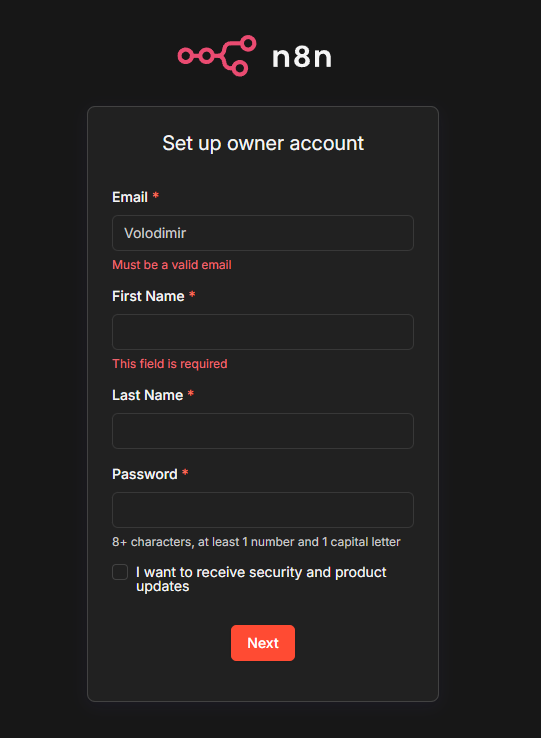

Al pasar el registro ya podemos empezar.

# Construcción del Workflow en n8n

` `Agregamos a nuestro workflow un webhook y cambiamos el método http a post.

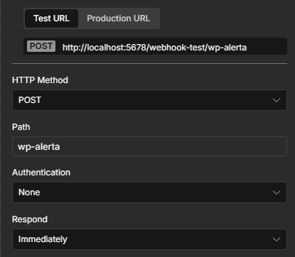

Ahora redirigimos este tráfico a un bloque HTTP request a la página [ip-api.com](http://ip-api.com) para que nos revele información de la ip que ha entrado.

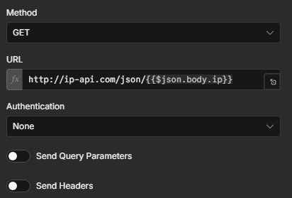

Lo mandamos a un operador if para que nos clasifique por localidad, si es nuestra localidad habitual, nos manda a un mensaje de telegram felicitando la identificación, si no, nos manda alerta con datos del atacante.

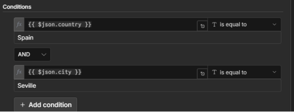

# Configuración Telegram

Para configurar el envío de los mensajes tenemos que consultar a un par de bots.

Primero tenemos a BotFather, que nos crea un bot y nos da la clave de acceso al bot para que haga acciones por nosotros.

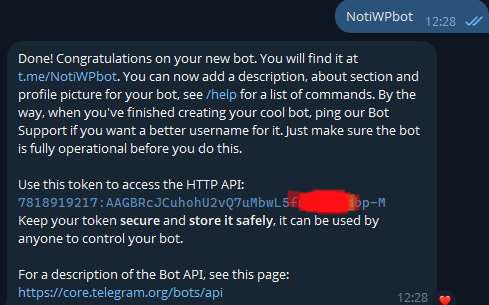

Por otra parte necesitamos saber nuestra id como usuario en Telegram, para saber a quien van dirigidos los mensajes. El bot se llama Get My ID

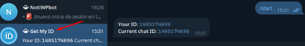

Con estos dos datos, podemos rellenar los campos en el módulo de telegram.

Ya solo nos falta rellenar los campos de los mensajes con variables.

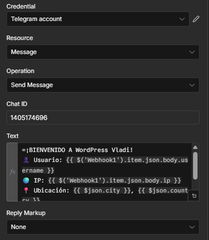

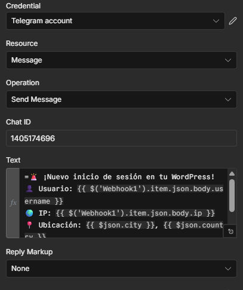

# Configuración de Wordpress + code snippets y ngrok

En el panel AWS, levantamos una instancia EC2, y configuramos wordpress con su servidor apache 2, su base de datos mysql, etc.

Una vez configurado todo, esta es la tienda improvisada:

A continuación entramos a /wp-login al panel de control WP y descargamos el plugin CodeSnippets.

Agregamos nuestro código custom. 

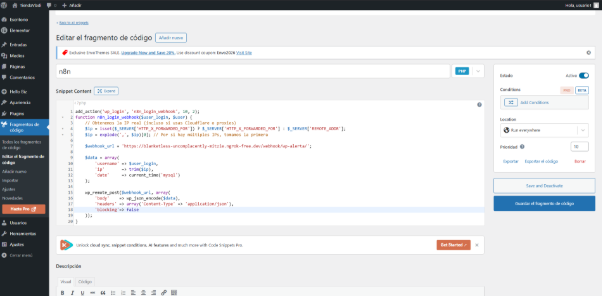

Este es el código 

add\_action('wp\_login', 'n8n\_login\_webhook', 10, 2);

function n8n\_login\_webhook($user\_login, $user) {

`    `// Obtenemos la IP real (incluso si usas Cloudflare o proxies)

`    `$ip = isset($\_SERVER['HTTP\_X\_FORWARDED\_FOR']) ? $\_SERVER['HTTP\_X\_FORWARDED\_FOR'] : $\_SERVER['REMOTE\_ADDR'];

`    `$ip = explode(',', $ip)[0]; // Por si hay múltiples IPs, tomamos la primera

`    `$webhook\_url = **'LA URL DEL WEBHOOK';**

`    `$data = array(

`        `'username' => $user\_login,

`        `'ip'       => trim($ip),

`        `'date'     => current\_time('mysql')

`    `);

`    `wp\_remote\_post($webhook\_url, array(

`        `'body'    => wp\_json\_encode($data),

`        `'headers' => array('Content-Type' => 'application/json'),

`        `'blocking'=> false 

`    `));

}

En este paso nos pide el código introducir un enlace para que llame a la webhook, como estamos en local, es inutil agregar el enlace de la webhook que nos proporciona n8n directamente, ya que lo tenemos en local. 

Necesitamos redireccionar el enlace desde la web a local, para eso usamos ngrok.

Con el comando ngrok http 5678 le damos entrada http al puerto 5678 (de n8n), y nos proporciona un enlace, el cual es el que vamos a usar en el campo url webhook.

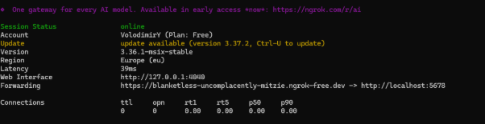

# Comprobación
Entramos a mi pagina web por el browser y agregamos /wp-login.php, los hackers suelen lanzar scripts a esa direccion ya que el la entrada por determinado al panel de acceso.

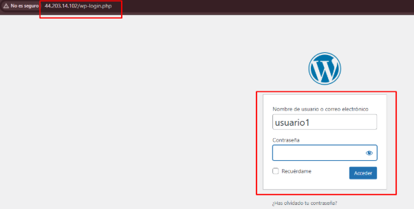

Una vez el hacker ha logrado averiguar tu contraseña, me llega el mensaje en privado.

Tengo su ip y localidad

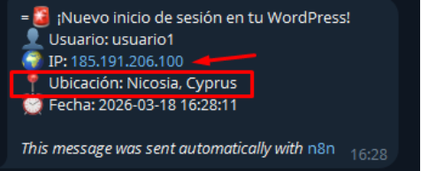

Esto es lo que ocurre si entro yo a mi propio wordpress

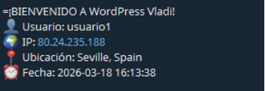

Ahora es un mensaje de bienvenida

